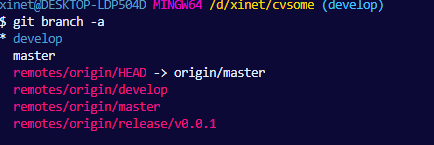
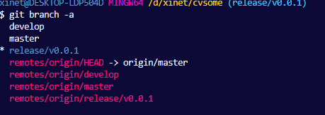

# 项目配置管理

项目配置管理（Project Configuration Management）简称 PCM，为了更加方便管理项目，需要对每个项目进行统一规范。

使用的项目管理工具是 [Git](https://git-scm.com/downloads) 与 [vscode](https://code.visualstudio.com/) 进行搭配。

下面将介绍如何创建一个项目？

## 1 项目初始化

- 目标：使用 Python 创建一个计算机视觉库（命名为 cvsome）

打开 vscode 并在终端输入：

```sh
$ git clone git@github.com:xinetzone/projects.git cvsome
$ cd cvsome
```

因为打算使用 Python 完成该项目，所以需要将 [demo.gitignore/python.gitignore](demo.gitignore/python.gitignore) 复制到 [.gitignore](.gitignore)，过滤到 Python 代码编译的中间文件。

将改动提交到 Git 仓库：

```sh
$ git add .
$ git commit -m  "修改 gitignore"
```

进行项目初始化操作：

```sh
$ mkdir data draft models outputs app notebook
```

关于 `data`，`draft`，`models`，`outputs`，`app`，`notebook` 的介绍参考 [initial](initial.md)。

为了更加快捷的管理项目，需要借助 Git 的扩展包 Git Flow：

```sh
$ git flow init
```

一路回车下去即可。至此，完成项目的初始化工作。

## 2 Git Flow 规则

接下来以实例介绍 Git Flow 的规则，方便后期使用。简单来说, Git Flow 将 branch 分成 2 个主要分支（master、develop）和 3 个临时的辅助分支（feature、release、hotfix）。

分支|简介
:-:|:-
master|永远处在即将发布(production-ready)状态
develop|最新的开发状态
feature|开发新功能的分支，基于 develop，完成后 merge 回 develop
release|准备要发布版本的分支，用来修复 bug. 基于 develop，完成后 merge 回 develop 和 master
hotfix|修复 master 上的问题，等不及 release 版本就必须马上上线. 基于 master，完成后 merge 回 master 和 develop

### 2.1 场景1：开发新功能

应用场景：需要开发一个用于爬取百度图片的 API

使用 Git Flow 开始创建项目的一个新功能 spide：

```sh
$ git flow feature start spide
```
这个操作创建了一个基于'develop'的特性分支 `feature/spide`，并切换到这个分支之下。

下面在 `app/` 目录下创建 `spide` 用于存放代码：

```sh
$ touch app/__init__.py
$ mkdir app/spide
$ touch app/spide/__init__.py
```

参考 [Python 3 多线程下载百度图片搜索结果](http://lovenight.github.io/2015/11/15/Python-3-多线程下载百度图片搜索结果/) 完成代码的开发工作。

代码早期开发可以放在 `draft` 中做测试，因为此时代码将不会被 Git 跟踪。待调试好代码将其放在 `app/spide/` 下面。这里编写了 `baiduimages.py` 用于下载给定一个关键字，如“猫”，便会从百度图片中下载与猫相关的图片。

将这些改动添加到 Git 管理中：

```sh
$ git add .
$ git commit -m "编写了 `baiduimages.py` 用于下载给定一个关键字，如“猫”，便会从百度图片中下载与猫相关的图片。"
```

新功能的开发已经完成，可以提交：

```sh
$ git flow feature finish spide
```

该操作完成以下工作：feature/spide 分支的代码会被合并到 develop 里面，然后删除该分支并切换回 develop。现在 master 分支要滞后于 develop 分支，需要将 develop 分支合并到 master 分支中：

```sh
$ git checkout master
```


此时项目的状态除去最初的 git@github.com:xinetzone/projects.git，仅仅可以供个人使用和开发。

### 2.2 Git 创建裸库

对于一个公司，项目便是金钱，我们不想将项目放到类似 GitHub 这种托管网站进行托管，而想要将项目放在公司内部的局域网内进行开发。基于此场景，需要舍弃源库 git@github.com:xinetzone/projects.git，重新创建一个裸库（类似于服务器）用于公司内部的开发。首先需要切换目录到 cvsome 项目之外：

```sh
$ cd ..
```

接着，执行如下命令创建一个名字为 `cvsome.git` 的裸库：

```sh
$ git clone --bare cvsome/ cvsome.git
```

此时的 `cvsome.git` 便是我们需要的服务器了。

只要在同一个局域网，便可以通过 `git clone` 克隆副本，现先考虑在同一台电脑的不同目录进行克隆：

```sh
$ git clone cvsome.git/ test/cvsome
```

这里 `test/cvsome` 是当前目录下的 `test` 目录存放项目于 `cvsome/`，也可以是决对路径，如 `D:/work/cvsome` 等。切换到克隆的新项目之下：

```sh
$ cd test/cvsome/
```

查看现在拥有的 branch：

```sh
$ git branch -a
```

显示终端：


从上图可以看到，拥有 3 个分支：一个本地分支 master 与两个远程分支 `remotes/origin/develop` 和 `remotes/origin/master`，且远程分支的 HEAD 指针指向 `origin/master`。

因为是新克隆的项目，需要对项目进行初始化：

```sh
$ mkdir data draft models outputs notebook
$ git flow init
```

考虑到项目的可读性，需要使用 Markdown 记录项目的细节，而说明项目细节时不免涉及到使用图片进行说明，我们还需要创建 `images` 目录用于存放图片：

```sh
$ mkdir images
```

### 2.3 场景2：发布上线，版本代号 0.0.1

应用场景：代码调试的差不多了，需要发布到线上（比如，公司内部的资源配置部门）。 允许修正小问题，并为发布版本准备元数据。使用 `git flow release start RELEASE [BASE]` 命令完成发布版本的创建（其中 `[BASE]` 参数，即 'develop' 分支下的提交记录的 sha-1 hash 值，通过 sha-1 hash 来开启动 release 分支），当前，直接基于最新的提交记录来创建发布版本：

```sh
$ git flow release start v0.0.1
```

该操作完成了如下工作：

- 基于 develop 创建分支 `release/v0.0.1`
- 切换到分支 `release/v0.0.1`

查看此时所有分支，终端图示：


可以看到在本地多了一个分支 `release/v0.0.1`，而你不想一个人开发此版本，需要将其提交到服务器：

```sh
$ git flow release publish v0.0.1
```

查看此时所有分支，终端图示可以看到多出分支 `remotes/origin/release/v0.0.1`：


我们将 `cvsome.git` 放在 `D:/server/cvsome.git` 位置，现又有一人加入到发布版本的开发中，首先从 `cvsome.git` 中克隆一个副本：

```sh
$ git clone D:/server/cvsome.git 
$ cd cvsome/ 
$ mkdir data draft models outputs notebook | git flow init
```

查看此时所有分支，终端图示：



从上图可以看出此人的本地分支没有 `release/v0.0.1`，那么该如何协助开发 `release/v0.0.1` 呢？这个很简单，Git Flow 提供了追踪：

```sh
$ git flow release track v0.0.1
```
对于版本号我们要求格式为：`x.y.z`，其中，`x` 用于有重大重构时才会升级，`y` 用于有新的特性发布时才会升级，`z` 用于修改了某个 bug 后才会升级。针对每个微服务，我们都需要严格按照以上开发模式来执行。

查看此时所有分支，终端图示：



从上图可以看出此人的本地分支存在 `release/v0.0.1`，那么便可以协助开发了。当有修改，提交到本地仓库后，需要将其推送到远端：

```sh
$ git add . | git commit -m 'U'
$ git push origin release/v0.0.1
```

而需要更新的一端，只需要执行如下命令即可：

```sh
$ git pull origin release/v0.0.1
```

当完成发布版本的工作时需要：

```sh
$ git flow release finish v0.0.1 -m "发布 v0.0.1"
```

该操作完成如下工作：

- 归并 release 分支到 'master' 分支并用 release 分支名打 Tag
- 归并 release 分支到 'develop' 并移除 release 分支与远端分支 `remotes/origin/release/v0.0.1`
- 切换到 'develop' 分支

查看此时所有分支，终端图示：


### 2.4 场景3：生产环境的版本处于一个不预期状态，需要立即修正

应用场景：有可能是需要修正 master 分支上某个 TAG 标记的生产版本

使用的命令是 `git flow hotfix start VERSION [BASENAME]`，其中 `VERSION` 参数标记着修正版本。你可以从 `[BASENAME]` 开始，`[BASENAME]` 为 `finish release` 时填写的版本号。

当完成紧急修复分支，代码归并回 develop 和 master 分支。相应地，master 分支打上修正版本的 TAG。（`git flow hotfix finish VERSION`）

注意：feature 与 hotfix 也都有 `publish`，`track` 具体的作用与 release 相类似。

参考资料：[git-flow 备忘清单](http://danielkummer.github.io/git-flow-cheatsheet/index.zh_CN.html)

### 2.5 总结

针对一个项目的创建，需要先从 `git@github.com:xinetzone/projects.git` 克隆一个项目的模板，然后依据需求修改项目的 `.gitignore` 用于忽视代码产生的中间文件。可以将模型的训练或者测试数据放在项目的任意位置的 `data/` 目录下，这样 Git 将会忽略掉。考虑到可读性并便于 Git 进行管理最好使用 Markdown 撰写项目的说明文档。项目的代码要放置在 `app/` 目录下。依据 2.1~2.4 选择对应的策略。多人协作时通过裸库建立联系，使用 `push` 与 `pull` 进行更新。在同一个局域网的不同电脑进行通信需要使用如下格式：

```sh
$ git clone lxw@192.168.20.57:/home/lxw/utils/sdk.git
```

其中 `@` 之前的 `lxw` 指代目标主机电脑的用户名，`192.168.20.57` 目标主机电脑的 IP 地址，`/home/lxw/utils/sdk.git` 指代裸库所在的绝对路径。

如果在 git clone 时不想克隆 master 分支，可以这样：

```sh
$ git clone -b 指定的远程分支名 GitHub-URL
```

用于克隆指定的分支。当很多 tag 分支版本的代码，我想克隆下载指定版本到我服务器上面，可以这样：

```sh
$ git clone --branch [tags标签] [git地址] # 或者 git clone -b [tags标签] [git地址]
```
